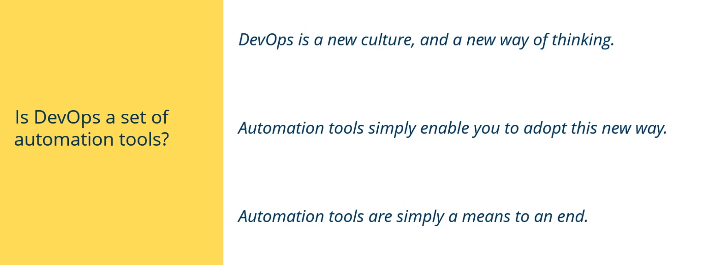

# Continuous Integration

## Old school:

## CI

# Continous Delivery

## Old School

## CD

Note: "CAN be released", means still can manully released

# CI/CD process

# Continuous Deployment

### Rollout

Continuous Deployment can rollout to specific IP's first (early release) i.e. Canada. If it goes well, then expand the IP to USA then All IPs.

If it goes not satisfied, it can also be "Rollback" to last scope of IPs

# DevOps

Dev teams can have one people from Ops team, and ops team can have one people of dev team.

